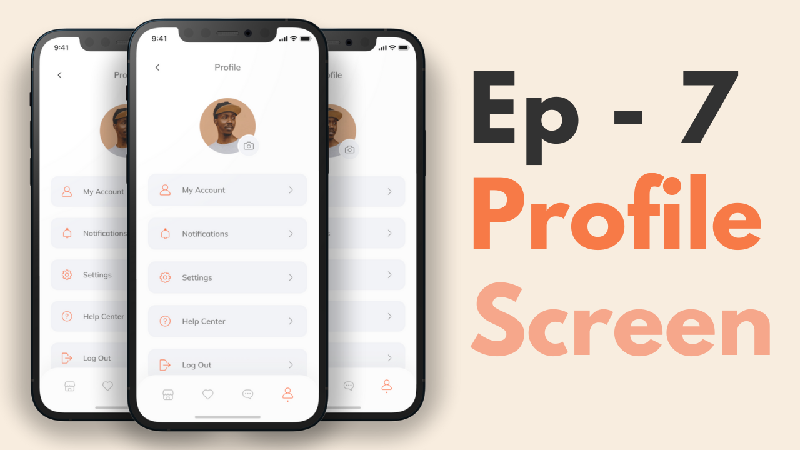

# Flutter E-Commerce App By Group 9

We start by making a neat onboarding screen for our shopping app. This works on both Android and iOS because it's made with Flutter. 

We tackle the 'Sign In' and 'Forgot Password' screens, adding some unique error messages. 

Then thirdly we covered the 'Sign Up' and OTP processes. 

The fourth one is fun – we create the main homepage. 

In the fifth, we dive into the product page, and in the sixth.

We crafted an order page with cool features like 'swipe to delete.' 

Finally, we designed the user profile page.

## Screens it contains:

=> Onboarding

=> Login

=> Forgot Password

=> Sign Up

=> Complete Profile

=> OTP Verification

=> Home Page

=> Product Details

=> Order

=> Profile (added)

=> Bottom Navigation Bar (added)

Now it contains all the screen, thanks for your love and support 🙏 

## Photos

